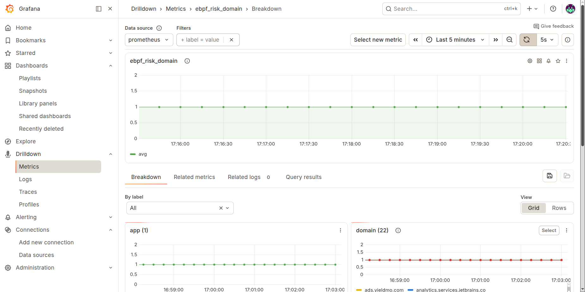
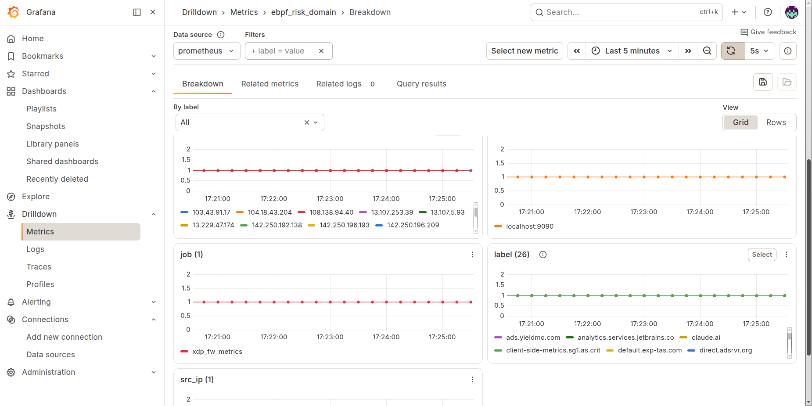
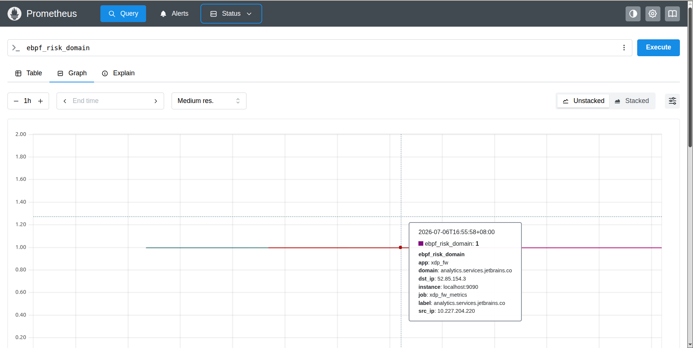
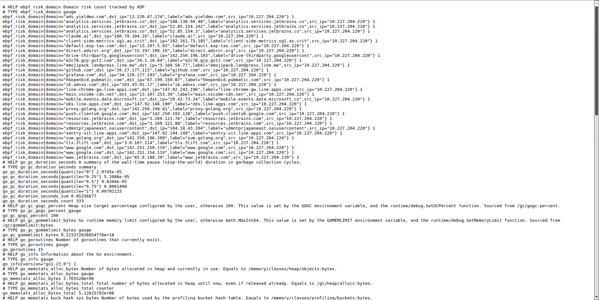

# 監控與可觀測性

## 整體監控串接

防火牆的統計資料最終以圖形化方式呈現，串接關係如下：

```
xdp_fw.c / trace_connect.c（eBPF 統計 / 事件）
        ↓
C++ 統計程式（Unix Socket 輸出二進位資料）
        ↓
Go Metric Exporter（詳見 docs/exporter.md）
        ↓ HTTPS /metrics
Prometheus（抓取並儲存時序資料）
        ↓
Grafana（將 Prometheus 資料繪製成儀表板圖像）
```

Go Exporter 如何啟動、連線 C++ 程式並轉譯 Metrics，請見 [`exporter.md`](exporter.md)。

## 自動啟動 Prometheus

```bash
sudo useradd --no-create-home --shell /usr/sbin/nologin prometheus

sudo chown -R prometheus:prometheus /opt/prometheus/prometheus-3.13.0.linux-amd64

sudo vim /etc/systemd/system/prometheus.service

sudo systemctl daemon-reload
sudo systemctl start prometheus
sudo systemctl enable prometheus
```

### systemd Service 範例（`/etc/systemd/system/prometheus.service`）

```ini
[Unit]
Description=Prometheus
Wants=network-online.target
After=network-online.target

[Service]
Type=simple

User=prometheus
Group=prometheus

WorkingDirectory=/opt/prometheus/prometheus-3.13.0.linux-amd64

ExecStart=/opt/prometheus/prometheus-3.13.0.linux-amd64/prometheus \
  --config.file=/opt/prometheus/prometheus-3.13.0.linux-amd64/prometheus.yml \
  --storage.tsdb.path=/opt/prometheus/prometheus-3.13.0.linux-amd64/data \
  --web.listen-address=0.0.0.0:9091

Restart=always
RestartSec=5

[Install]
WantedBy=multi-user.target
```

---

## 最終視覺化結果

透過 Go Exporter 將 C++ 統計資料轉為 Metrics 後，由 Prometheus 抓取、Grafana 繪製成圖像化儀表板，以下為實際呈現效果：

### Grafana 取得 Prometheus Metric




### Prometheus 取得 XDP Metric




---

## 可觀測性延伸方向

- `attack_score_map` 分數變化透過 Ring Buffer 推送，外接 Prometheus metrics
- `status_code` 三段解碼（見 [`userspace.md`](userspace.md#status_code-32-bit-分層編碼)）接入 ELK / Loki 結構化日誌

更多規劃細節請見 [`roadmap.md`](roadmap.md#63-進階架構演進)。
